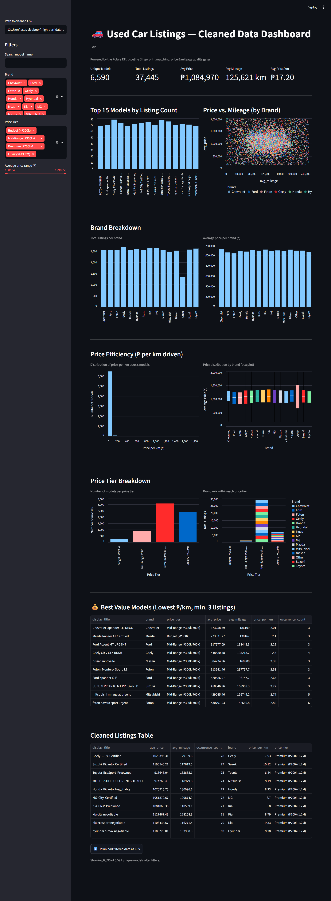

# 🚗 Car Data Pipeline

A high-performance Python ETL (Extract, Transform, Load) pipeline for generating, cleaning, validating, and visualizing used car listing datasets. This project demonstrates an end-to-end data engineering workflow by transforming raw vehicle listings into clean, analysis-ready datasets with an interactive Streamlit dashboard.

---

## 📌 Features

- 🚗 Generate realistic used car listing datasets
- 🧹 Clean and validate messy automotive data
- 📊 Configurable data quality threshold
- ⚙️ Automated ETL pipeline
- 📈 Interactive Streamlit dashboard
- 🔍 Search and filter by brand, model, and price tier
- 💰 Price efficiency analysis (₱ per km)
- 🏷️ Brand and model performance analytics
- 📥 Export filtered datasets as CSV
- ✅ Unit testing with Pytest

---

# 📂 Project Structure

```text
car-data-pipeline/
│
├── assets/
│   └── dashboard-preview.png
│
├── dashboard/
│   └── app.py
│
├── src/
│   └── pipeline.py
│
├── tests/
│
├── generate_data.py
├── requirements.txt
├── README.md
├── LICENSE
│
├── dirty_car_listings.csv
├── clean_car_listings.csv
├── dirty_catalogue.csv
└── clean_catalogue.csv
```

---

# 🛠 Technologies Used

- Python 3
- Pandas
- NumPy
- Streamlit
- Pytest

---

# 🚀 Getting Started

## 1. Clone the Repository

```bash
git clone https://github.com/AlvinTubtub/car-data-pipeline.git
cd car-data-pipeline
```

---

## 2. Create a Virtual Environment

```bash
python -m venv .venv
```

Activate the virtual environment (Windows):

```bash
.venv\Scripts\activate
```

---

## 3. Install Dependencies

```bash
pip install -r requirements.txt
```

---

## 4. Generate Sample Data

```bash
python generate_data.py
```

This creates the sample dirty datasets used by the pipeline.

---

## 5. Run the Data Pipeline

```bash
python src\pipeline.py -i dirty_car_listings.csv -o clean_car_listings.csv -r 58.0
```

### Command Parameters

| Parameter | Description |
|-----------|-------------|
| `-i` | Input dirty CSV file |
| `-o` | Output cleaned CSV file |
| `-r` | Minimum quality score required |

Example:

```bash
python src\pipeline.py -i dirty_car_listings.csv -o clean_car_listings.csv -r 58.0
```

---

## 6. Launch the Dashboard

```bash
streamlit run dashboard\app.py
```

Open your browser and visit:

```
http://localhost:8501
```

---

# 🔄 Project Workflow

```text
Generate Sample Data
        │
        ▼
Dirty Car Listings
        │
        ▼
Python ETL Pipeline
        │
        ├── Data Validation
        ├── Missing Value Handling
        ├── Duplicate Removal
        ├── Data Cleaning
        ├── Quality Scoring
        └── Data Transformation
        │
        ▼
Clean Car Listings
        │
        ▼
Interactive Streamlit Dashboard
        │
        ▼
Data Exploration & CSV Export
```

---

# 📊 Dashboard Preview

The Streamlit dashboard provides interactive insights into the cleaned used car listings dataset.

### Dashboard Features

- 📌 Summary KPIs
- 🚗 Top vehicle models by listing count
- 💰 Price vs. mileage analysis
- 🏷️ Brand performance breakdown
- 📈 Price efficiency analysis (₱/km)
- 💎 Price tier distribution
- ⭐ Best value vehicle recommendations
- 📋 Interactive cleaned listings table
- 📥 Download filtered data as CSV

<p align="center">
  
</p>

---

# 📁 Sample Files

| File | Description |
|------|-------------|
| dirty_car_listings.csv | Raw used car listing dataset |
| clean_car_listings.csv | Cleaned used car listings |
| dirty_catalogue.csv | Raw vehicle catalogue |
| clean_catalogue.csv | Cleaned vehicle catalogue |

---

# 🧪 Running Tests

Run all unit tests:

```bash
pytest
```

or

```bash
pytest tests
```

---

# 📈 Dashboard Analytics

The dashboard provides interactive analytics including:

- Total Listings
- Unique Models
- Average Price
- Average Mileage
- Price per Kilometer
- Brand Distribution
- Model Distribution
- Price Tier Analysis
- Price vs Mileage Scatter Plot
- Best Value Vehicle Ranking
- Downloadable Filtered Dataset

---

# 📌 Future Improvements

- Docker support
- Database integration
- Cloud deployment
- REST API
- Scheduled ETL jobs
- Machine Learning price prediction
- Real-time vehicle listing ingestion

---

# 👨‍💻 Author

**Alvin Tubtub**

GitHub: https://github.com/AlvinTubtub

---

# 📄 License

This project is licensed under the MIT License.

---

## ⭐ Support

If you found this project useful, consider giving it a **Star ⭐** on GitHub.
